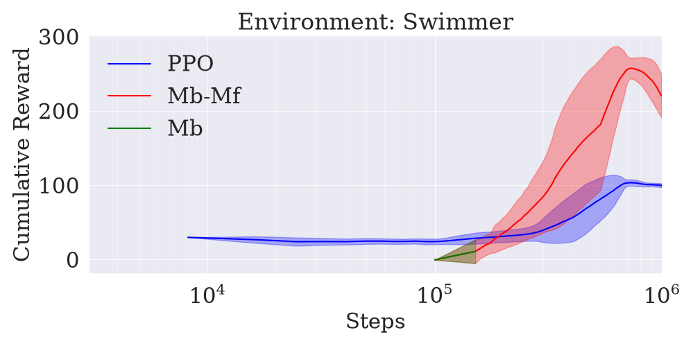
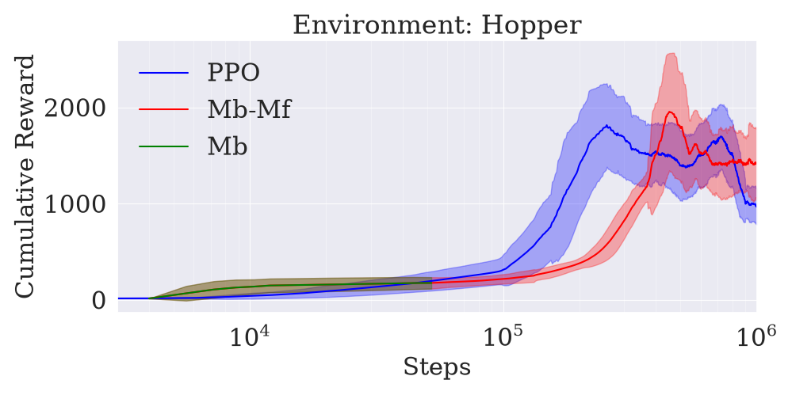
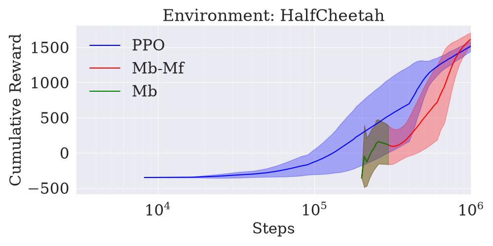

# Reinforcement Learning Algorithms

This repository contains implementations of various Reinforcement Learning (RL) algorithms, from tabular Q-Learning on classic games to deep policy-gradient methods on MuJoCo continuous-control tasks.

## Installation

To install the necessary libraries, run:

```bash
python3 -m venv RLAlgos
source RLAlgos/bin/activate # Linux/macOS
pip install -r requirements.txt
```

## 1. Q-Learning

### Tic-Tac-Toe
A zero-sum self-play implementation where an agent learns to play Tic-Tac-Toe optimally using the Q-Learning algorithm.

#### How to Start
To run the Tic-Tac-Toe game, execute the following command from the root directory:

```bash
python3 Q-Learning/TicTacToe.py
```

#### What's Happening in the Background
- **Self-Play Training:** When the program starts, it checks for an existing `q_table.pkl` in the `Q-Learning/` directory. If not found, the agent trains by playing against itself for 1,000 episodes.
- **Learning Rule:** The agent uses a minimax-style Q-learning update:

  `V(s, a) = V(s, a) + alpha * (reward - gamma * max(V(s', a')) - V(s, a))`
  By subtracting the maximum Q-value of the next state, the agent accounts for the opponent's optimal response.
- **Persistence:** After training, the agent's knowledge is saved to `Q-Learning/q_table.pkl`, allowing it to skip training in future sessions.
- **Decision Making:** During gameplay, the agent uses its learned Q-values to choose the action with the highest expected reward (epsilon is set to 0 for optimal play).

#### Interpreting Terminal Colors
The game board uses color-coding to visualize the agent's "thoughts" for each available move. This helps you understand how the agent evaluates the current board state:

- **Green Background:** High Q-value. The agent evaluates this as a strong move likely leading to a win or a draw.
- **Red Background:** Low Q-value. The agent evaluates this as a weak move likely leading to a loss.
- **Mud Green Tones:** Neutral or uncertain evaluation.


## 2. Policy Gradient Methods

### CartPole

#### How to Start
To run the CartPole simulation, execute the following command from the root directory:

```bash
python3 PolicyGradientMethods/CartPole.py
```

<!-- #### What's Happening in the Background -->

## 3. Proximal Policy Optimization (PPO)

An on-policy actor-critic method for continuous control ([Schulman et al., 2017](https://arxiv.org/abs/1707.06347)). Each iteration runs the current policy in 8 parallel MuJoCo environments, scores the collected actions with Generalized Advantage Estimation, and then takes several epochs of minibatch SGD on that batch. The "proximal" part is a *clipped* surrogate objective: the importance ratio between the new and old policy is clamped to `[1-ε, 1+ε]`, so a single high-advantage sample can never push the update arbitrarily far. That is what makes it safe to reuse the same batch for 10 epochs instead of throwing it away after one gradient step.

#### How to Start
Select an environment by editing `env_id` near the top of the file (`HalfCheetah-v5`, `Hopper-v5` or `Swimmer-v5` are pre-configured), then run from the root directory:

```bash
python3 ProximalPolicyOptimization/ppo.py
tensorboard --logdir runs   # in a second terminal
```

All other hyperparameters are module-level globals in the same block — edit them in place. A run trains for 1,000,000 environment steps and writes metrics plus the final weights to `runs/PPO_{env_id}_{seed}_{timestamp}/`.

## 4. Model-Based Model-Free (MB-MF)

A hybrid that uses a learned dynamics model to give PPO a head start ([Nagabandi et al., 2017](https://arxiv.org/abs/1708.02596)). It runs in four phases:

1. **Model-based.** Collect a dataset with random actions, train a neural network to predict state *differences* `s' - s`, and control the robot with random-shooting MPC: sample K candidate action sequences, simulate them through the learned model, and execute the first action of the best-scoring one. New data is aggregated and the model retrained.
2. **Behavioral cloning.** Distill the MPC controller into the PPO actor network by regressing on its actions, refined with DAgger.
3. **Critic warm-up.** Fit the value function on rollouts of the cloned policy, since PPO — unlike the TRPO used in the paper — needs a critic to compute advantages.
4. **Model-free.** Hand the warm-started agent to the exact same `train_ppo` loop used by the baseline.

The script imports `Agent`, `init_gymnasium` and `train_ppo` from `ppo.py`, so both arms of the comparison share identical network definitions and training code — any difference between them comes from the warm start alone. Steps spent in phases 1–3 are subtracted from PPO's budget, so a MB-MF run consumes the same 1,000,000 total environment steps as the baseline.

#### How to Start
Select `env_id` at the top of the file as above (each environment has its own tuned block of MPC and cloning hyperparameters), then run from the root directory:

```bash
python3 ModelBasedModelFree/mbmf.py
tensorboard --logdir runs   # in a second terminal
```

Two log directories are written: `runs/MBMF_{env_id}_{seed}_{timestamp}/` for the full run, and a `..._Phase1_MB/` suffix holding only the model-based phases, which makes it easy to plot the warm start separately from the fine-tuning.

## Results: PPO vs. MB-MF

Both algorithms were run for 1,000,000 environment steps on each task, with a single seed and identical network, hyperparameters and training loop. Each plot shows three curves: **PPO** (blue) trained from scratch, **Mb-Mf** (red) warm-started by the model-based phases, and **Mb** (green) the model-based phases on their own. Curves are a rolling mean over logged episodes with a shaded standard deviation.

| Swimmer-v5 | Hopper-v5 | HalfCheetah-v5 |
|---|---|---|
|  |  |  |

Because the model-based phases are charged against the same 1M budget, the red curve starts at the step count where the warm start finished — 150,624 steps for Swimmer, 52,000 for Hopper and 296,000 for HalfCheetah.

The plots are generated from TensorBoard CSV exports placed in `graphs/`. The script must be run from inside that directory, since it resolves the CSV filenames relative to the working directory:

```bash
cd graphs && python3 create_graphs.py
```

`create_graphs.py` currently contains three consecutive `datasets = {...}` blocks, one per environment, so only the last one takes effect — comment out the others to switch environments. Output is always written to `recreated_plot.png` and was renamed by hand to `Swimmer.png`, `Hopper.png` and `HalfCheetah.png`.

<!-- ## Future Algorithms -->
<!-- This repository is designed to expand. Future additions will include: -->
<!-- - **Deep Q-Networks (DQN)** -->
<!-- - **SARSA** -->
<!-- - **Actor-Critic Models** -->
<!-- - **Policy Gradient Methods**
- **Trust Region Policy Optimization (TRPO)**
- **Proximal Policy Optimization (PPO)** -->
